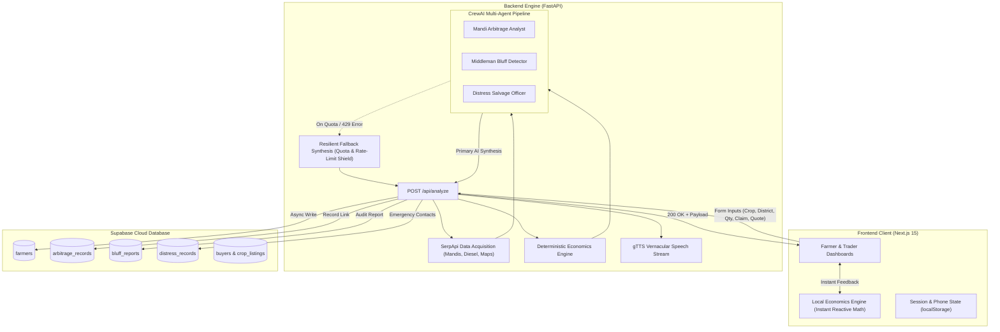

# 🤖 KisanPulse Multi-Agent Intelligence Architecture

KisanPulse combines an autonomous **CrewAI multi-agent pipeline** powered by Google Gemini (`gemini-3.5-flash-lite`) and Groq (`llama-3.3-70b-versatile`) with a deterministic agricultural economics engine and real-time **Supabase** persistence.

The system empowers Indian farmers with asymmetric market intelligence by analyzing ground-truth APMC mandi prices, factoring in transit logistics, unmasking predatory middleman claims, and discovering emergency distress offtakers.

---

## 🏛️ System Architecture Diagram

---

## 👥 Specialized Agents

### 1. Mandi Arbitrage & Economics Analyst 🧮
* **Role:** Chief Agricultural Economist & Logistics Calculator
* **Goal:** Determine the highest net-profit APMC market for the farmer after strictly deducting transport freight, perishability shrink, and regional diesel expenditures.
* **Backstory:** Specialized in Indian APMC wholesale supply chains. Refuses to judge opportunities on headline modal price alone; evaluates the "True-Net Take-Home Yield".
* **Tools & Ground Truth:**
  * `fetch_mandi_prices`: Scrapes real-time modal and minimum/maximum arrival rates across regional mandis via SerpApi.
  * `fetch_diesel_price`: Ingests real-time district fuel rates (e.g. ₹92–₹101/L) for freight calculations.
  * `calculate_net_yield`: Computes dynamic trucking burn rates based on distance and load tonnage.
* **Core Heuristic:**
  $$\text{Net Take-Home} = (\text{Quoted Price} \times \text{Quantity}) - \text{Transit Freight} - \text{Perishability Spoilage}$$
  Recommends whether traveling to a regional hub (e.g. 48 km away) yields higher take-home profit than selling at the immediate local mandi (e.g. 12 km away).

---

### 2. Middleman Bluff Detector & Negotiation Wingman 🛡️
* **Role:** Trader Claim Auditor & Vernacular Counter-Negotiation Wingman
* **Goal:** Protect farmers against deceptive commission agent (adtiya) tactics by cross-verifying claims with terminal market news and generating assertive counter-negotiation scripts.
* **Backstory:** An aggressive advocate for farmer equity with deep knowledge of psychological pricing traps (e.g., "Azadpur crashed today", "Cold storage is overflowing").
* **Tools & Ground Truth:**
  * `verify_buyer_claim`: Cross-references trader statements with real-time news headlines from major terminal hubs (Delhi Azadpur, Vashi Mumbai, etc.).
  * `analyze_middleman_claim`: Computes the exact percentage margin gap:
    $$\text{Margin Gap \%} = \frac{\text{Modal Price} - \text{Trader Offer}}{\text{Modal Price}} \times 100$$
* **Risk Categorization:**
  * **LOW RISK** ($\le 10\%$ gap): Fair local market quote.
  * **MODERATE RISK** ($11\% - 25\%$ gap): Under-market quote; caution advised.
  * **HIGH RISK BLUFF** ($> 25\%$ gap): Predatory undercut; triggers counter-script.
* **Vernacular Output:** Produces natural, assertive scripts in the farmer's native dialect (**Hindi**, **Marathi**, or **English**) ready for speech playback via `gTTS`.

---

### 3. Emergency Distress Salvage Officer 🚨
* **Role:** Commercial Crop-Dumping Prevention & Alternative Offtake Broker
* **Goal:** Prevent total financial wipeout when wholesale APMC rates collapse below harvesting break-even points.
* **Backstory:** Supply chain crisis manager. When market prices crater, bypasses traditional mandis to connect farmers with industrial processors, sauce/puree manufacturers, hotel base kitchens, and commercial cold storages.
* **Activation Trigger:**
  * Activates automatically when quoted or modal prices dip below critical crop cost benchmarks (e.g., Tomato < ₹5/kg, Potato < ₹6/kg, Onion < ₹8/kg).
* **Tools & Ground Truth:**
  * `find_distress_salvage_buyers`: Discovers verified agro-processors, food factories, and bulk cold storages in the district using SerpApi Maps.

---

## 🛡️ Resilience & High-Availability Engine

To guarantee zero downtime and uninterrupted database persistence during hackathon evaluations and field use:

1. **Dual LLM Provider Routing:**
   * Primary: Google Gemini (`gemini-3.5-flash-lite`) via `google-genai` / CrewAI.
   * Fallback: Groq (`llama-3.3-70b-versatile`) for ultra-low latency inference.
2. **Windows UTF-8 Console Compatibility:**
   * Dynamic `sys.stdout.reconfigure(encoding="utf-8", errors="replace")` prevents `charmap` codec exceptions caused by emojis (`🚀`, `🤖`) on Windows consoles.
3. **Deterministic Math Fallback Shield:**
   * If an LLM call exceeds quota (HTTP 429) or experiences network drops, `run_kisanpulse_pipeline` automatically intercepts the exception and synthesizes deterministic calculations derived from real APMC price data.
4. **Guaranteed Supabase Persistence:**
   * The `/api/analyze` controller guarantees that regardless of LLM status, True-Net calculations and bluff verification reports are **unconditionally committed to Supabase tables**.

---

## 📊 Supabase Data Contracts

| Table | Purpose | Key Attributes |
| :--- | :--- | :--- |
| `farmers` | Farmer directory | `phone`, `district`, `preferred_language` |
| `arbitrage_records` | Mandi comparisons & decisions | `farmer_phone`, `crop`, `district`, `best_mandi`, `net_take_home`, `arbitrage_comparison` |
| `bluff_reports` | Middleman audit log | `arbitrage_id`, `trader_claim`, `buyer_quote_per_kg`, `bluff_score`, `margin_gap_pct`, `counter_script` |
| `distress_records` | Emergency salvage events | `crop`, `district`, `salvage_contacts` |
| `buyers` | Commercial trader profiles | `phone`, `company_name`, `gst_number` |
| `crop_listings` | Active farm-gate harvest feed | `farmer_phone`, `crop`, `quantity_quintals`, `expected_price_per_kg`, `is_distress` |
| `buyer_offers` | Procurement bids & negotiations | `listing_id`, `buyer_phone`, `offer_price_per_kg`, `status` |